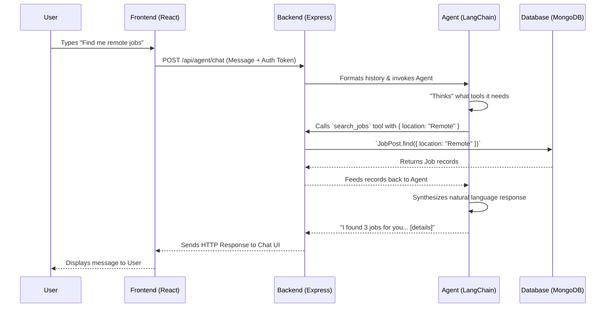

# Agentic AI in CareerCompass: A to Z Guide

Welcome to the comprehensive guide on the Agentic AI implementation within the CareerCompass platform. This document explains what it is, how it works behind the scenes, and provides a step-by-step tutorial on how to demonstrate its capabilities.

---

## What is the Agentic AI?

Traditional AI chatbots only chat; they answer questions based on the text you send them. 
An **Agentic AI** acts as a smart "agent" that can take actions on the user's behalf. It uses an LLM (Large Language Model) not just to generate text, but as a "brain" to orchestrate a sequence of actions. It has access to **tools** (functions) that it can call to interact with the database, apply for jobs, update profiles, and read data—all through natural language instructions.

In CareerCompass, the AI Agent acts as a personal career assistant. When a user asks "Can you update my bio to say I'm a senior developer?", the agent parses the intent, triggers the internal `update_user_profile` tool, updates the MongoDB database, and replies "I've successfully updated your bio!".

---

## How It Works: The Architecture & Data Flow

The Agentic AI is built using **LangChain.js** in the Node.js/Express backend (`backend/src/controllers/agentController.ts`) and uses OpenAI's GPT models under the hood. 

### The Request Flow

### Key Components

1. **`AgentChat.tsx` (Frontend)**
   - Located in `frontend/src/components/AgentChat.tsx`.
   - The React component the user interacts with. It maintains UI state, shows typing indicators, and renders the chat.
2. **`agentController.ts` (Backend Controller)**
   - Located in `backend/src/controllers/agentController.ts`.
   - Verifies user authentication.
   - Fetches the user's chat history from MongoDB (`AgentSession`).
   - Instantiates the LangChain agent with the system prompt, giving it context about who the user is (e.g. user ID, name, role).
3. **`agentTools.ts` (The Action Engine)**
   - Located in `backend/src/services/agentTools.ts`.
   - Contains a registry of Zod-validated "Tools". These are specific functions the AI can execute. They take JSON arguments, do something in MongoDB, and return a string back to the AI.
4. **`AgentSession` (Memory Database Model)**
   - Ensures the AI agent remembers the context. It saves the entire conversation up to 100 messages per user, associating it to their `userId`.

---

## What Can the Agent Do? (The Tools)

The agent has access to **12 specialized tools**, empowering it to fully control a candidate's workflow:

> [!TIP]
> The agent is autonomous. It automatically figures out which tool to use, how to parse your natural language into tool parameters, and handles missing information perfectly!

### 👤 Profile Management
- **`get_user_profile`**: Reads the user's current profile, bio, location, etc.
- **`update_user_profile`**: Updates the user's name, bio, position, location, contact details, and social links.

### 💼 Job Discovery & Actions
- **`search_jobs`**: Searches for job postings in the database based on keywords and location.
- **`get_job_details`**: Takes a specific Job ID and reads the heavy details about it (salary ranges, full requirements).
- **`apply_to_job`**: Automatically creates a new `JobApplication` record for a specific job.
- **`save_job`**: Bookmarks/saves a job to the user's `SavedJobs` list.
- **`get_saved_jobs`**: Looks at the user's bookmarked jobs.
- **`get_my_applications`**: Shows all jobs the user has already applied to and their status.

### 🎓 Resume Building / Progress
- **`add_skill`**: Injects a custom skill (and proficiency level) into the user's profile.
- **`add_experience`**: Creates a new past work experience entry.
- **`add_education`**: Records a user's degree, major, and school.
- **`add_certification`**: Saves details about professional certifications (like AWS, Azure).

---

## How to Demonstrate It End-to-End

To show off the agent's capabilities in a presentation, follow this seamless script showing the agent's intelligence, memory, and automated actions.

### Prerequisites Check
1. Make sure your MongoDB is running.
2. Verify `OPENAI_API_KEY` is inside your `backend/.env` file.
3. Start the application: `npm run dev` in both backend and frontend.

### The Demonstration Script

**Step 1: Introduction & Memory Check**
Open the Agent Chat widget in the Candidate Dashboard.
* **You type**: *"Hi there! I'm John Doe."*
* **Agent replies**: *"Hi John..."*
* **You type**: *"What's my name again?"*
* **What to highlight**: Show how the AI retains memory within the session model. It doesn't need to ask you twice.

**Step 2: Profile Update (Tool Execution)**
* **You type**: *"Could you check my current profile? If my bio is empty, please update it to say 'I am a passionate software engineer excited to build AI tools' and set my location to 'New York'."*
* **What happens**: The agent will smartly execute `get_user_profile` to check. Then it executes `update_user_profile`. 
* **What to highlight**: Close the chat or navigate to the Profile Settings page on the frontend and show that the bio and location have *literally* been updated in the database without touching a form.

**Step 3: Resume Expansion**
* **You type**: *"I just got my AWS Solutions Architect Associate certification today! Can you add that to my profile?"*
* **What happens**: Agent parses the natural language, identifies the name "AWS Solutions Architect Associate", and calls `add_certification`. Let it confirm.

**Step 4: The Core Workflow (Search -> Save -> Apply)**
This is the "wow" factor of the agent.
* **You type**: *"Can you search for some remote Frontend Developer jobs?"*
* **What happens**: The agent uses `search_jobs` and returns a formatted list with Job IDs.
* **You type**: *"Job #2 looks interesting. Can you tell me more about it and then save it for later?"*
* **What happens**: It executes `get_job_details` using the Job ID and then instantly executes `save_job`. Note how it chained two tools together effortlessly!
* **You type**: *"Actually, you know what, I'm confident. Submit an application to that job for me right now."*
* **What happens**: The agent fires `apply_to_job`. 
* **What to highlight**: Go to the "My Applications" tab on the frontend. Show the audience that the job has officially moved into the "Pending Application" state.

**Step 5: Recall Actions**
* **You type**: *"Wait, what jobs have I applied to so far?"*
* **What happens**: The agent executes `get_my_applications` and lists them out, effectively proving that the Agent has visibility over the user's entire domain state.

---

### Security & Limitations (Good talking points)
- **Tool Level Auth**: The tools use `context.userId` which comes directly from the cryptographically signed JWT token. The AI cannot be "tricked" into fetching or updating another user's profile.
- **Cache Invalidation**: Every time the AI mutates the database (e.g., adding an experience), it correctly calls `invalidateCache` to ensure the frontend sees live data immediately.
- **Sanitization**: All user messages are routed through `validateUserMessage` and `sanitizeMessage` inside `backend/src/utils/agentSecurity.ts` to prevent prompt injection or malicious API strings.
